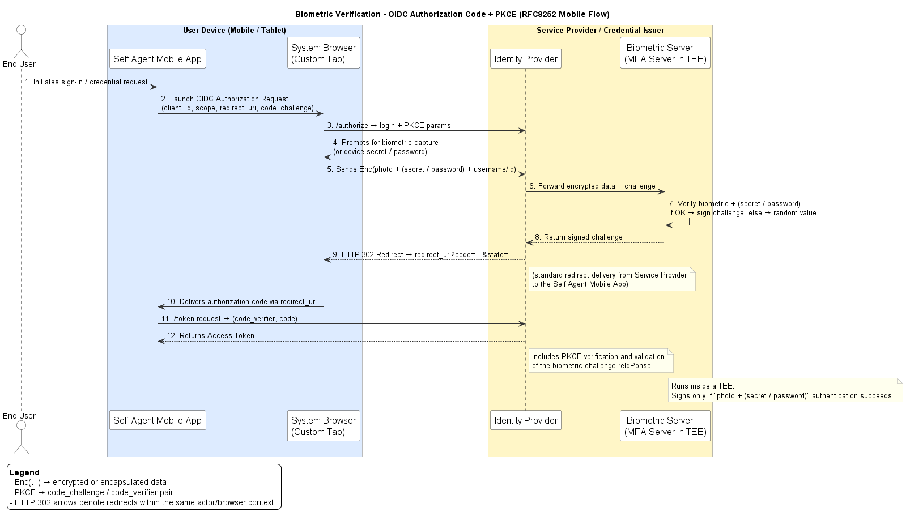

# Identity Provider with OIDC and External Biometric Verification

Research-grade OpenID Connect Identity Provider (IdP) that delegates biometric enrollment and authentication to an external WSCD service. The IdP itself does not perform biometric processing; it only orchestrates OIDC and verifies the cryptographic assertions returned by WSCD.

## Overview

This project provides a minimal OIDC IdP for controlled or high-assurance environments where authentication is backed by a biometric cryptographic service. The IdP implements the OIDC authorization code flow with PKCE support and uses a local, in-memory store for clients, codes, tokens, and registered credentials. Enrollment and authentication are delegated to WSCD via HTTP calls; the IdP stores the returned public credential and verifies signatures during login.

## Architecture and Authentication Flow



## Requirements

- Docker (for the supported run path).
- Network access from the container to the WSCD service (`BIO_SERVER_URL`).
- A client application configured with the same `CLIENT_ID` and `REDIRECT_URI` as the IdP.

## How to Build and Run (Docker)

Build the image:

```bash
docker build -t idp-oidc:local .
```

Run the container with a minimal, realistic configuration:

```bash
docker run --rm -p 8080:8080 \
  -e SECRET_KEY="change-me" \
  -e OIDC_ISSUER="https://idp.example.test:8080" \
  -e OIDC_ISSUER_BACKEND="https://idp.example.test:8080" \
  -e CLIENT_ID="rp" \
  -e REDIRECT_URI="https://rp.example.test/auth/callback" \
  -e RP_ID="example.test" \
  -e ORIGIN="https://idp.example.test:8080" \
  -e BIO_SERVER_URL="https://wscd.example.test" \
  idp-oidc:local
```

The container listens on `https://<host>:8080` (self-signed TLS via Flask's `adhoc` mode).

## Configuration (Environment Variables)

All variables are defined in `oidc_app/config.py`. Defaults are provided but are not suitable for production.

| Variable | Required | Default | Description |
| --- | --- | --- | --- |
| `SECRET_KEY` | Yes | `dev-unsafe` | Flask session signing key. |
| `OIDC_ISSUER` | Yes | `https://idp.licorice-us.eu` | Public issuer URL returned in discovery metadata and tokens. |
| `OIDC_ISSUER_BACKEND` | Yes | `https://idp.licorice-us.eu` | Backend issuer used for token/JWKS endpoints when different from public URL. |
| `CLIENT_ID` | Yes | `rp` | Single registered OIDC client ID. |
| `REDIRECT_URI` | Yes | `https://wallet.licorice-us.eu/auth/callback` | Redirect URI allowed for the client. |
| `RP_ID` | Yes | `licorice-us.eu` | Relying Party ID used for WebAuthn/WSCD operations. |
| `ORIGIN` | Yes | `https://idp.licorice-us.eu` | Origin expected by the WebAuthn flow. |
| `BIO_SERVER_URL` | Yes | `https://wscd.carloslancha.es` | Base URL of the WSCD biometric service. |
| `API_ENROLLMENT` | No | `/api/mceliece/enrollment` | WSCD enrollment endpoint path. |
| `API_VERIFICATION` | No | `/api/mceliece/verification` | WSCD verification endpoint path. |

## OIDC Details

- Supported flow: authorization code with optional PKCE (`S256` or `plain`).
- Discovery: `/.well-known/openid-configuration`.
- Tokens: the `/token` endpoint issues an `access_token` and `id_token`. The `id_token` is signed with an ephemeral RSA key generated at startup and exposed via `/jwks.json`.
- UserInfo: `/userinfo` returns basic `sub`, `email`, and `name` claims for a valid bearer token.

## Security Notes

- This implementation uses in-memory storage for clients, authorization codes, access tokens, and credentials. Restarting the process clears all state.
- `id_token` signing keys are generated in memory at startup and are not persisted.
- TLS verification is disabled for WSCD HTTP calls (`verify=False`); this is unsafe outside controlled test environments.
- The default Flask configuration uses `debug=True`, self-signed TLS, and `SESSION_COOKIE_SECURE=False`, which are not suitable for production.

## Intended Use and Non-Goals

Intended use:

- Research and controlled deployments where the WSCD service is trusted and reachable.
- Demonstrations of OIDC integration with external biometric cryptographic verification.

Non-goals:

- Full production-hardening, high availability, or persistent storage.
- Support for multiple dynamic OIDC clients or advanced OIDC/OAuth features beyond the authorization code flow.
- Performing biometric processing within the IdP itself.
